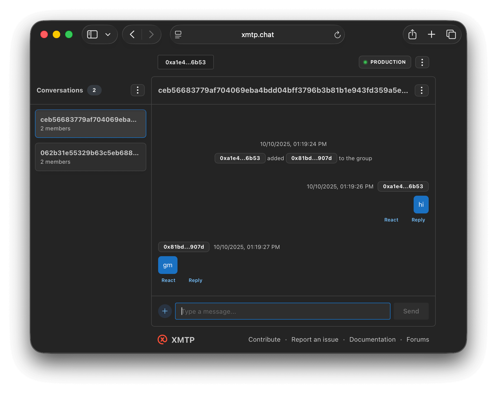

# XMTP Agent with Groq AI

An XMTP agent powered by Groq's LLM API that provides intelligent responses with tool calling capabilities. This agent can answer questions about cryptocurrency prices and engage in natural conversations.



### Requirements

- Node.js v20 or higher
- pnpm v10 or higher

### Environment variables

To run your XMTP agent, you must create a `.env` file with the following variables:

```bash
XMTP_WALLET_KEY= # the private key of the wallet
XMTP_DB_ENCRYPTION_KEY= # a second random 32 bytes encryption key for local db encryption
XMTP_ENV=dev # local, dev, production
GROQ_API_KEY= # your Groq API key from https://console.groq.com
```

### Run the agent locally

```bash
# clone the repository
git clone <your-repo-url>
# navigate to the folder
cd base-xmtp-agent
# install packages
pnpm install
# generate random xmtp keys (optional)
pnpm gen:keys
# run the agent
pnpm dev
```

### Deploy to Railway

This project is configured for deployment on Railway:

1. Create a new project on [Railway](https://railway.app)
2. Connect your GitHub repository
3. Add the required environment variables in Railway's dashboard:
   - `XMTP_WALLET_KEY`
   - `XMTP_DB_ENCRYPTION_KEY`
   - `XMTP_ENV`
   - `GROQ_API_KEY`
4. Railway will automatically detect the build configuration and deploy

The agent uses `pnpm` as the package manager and will build using `pnpm build` and start with `pnpm start`.
